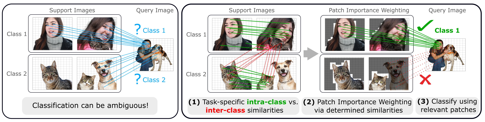
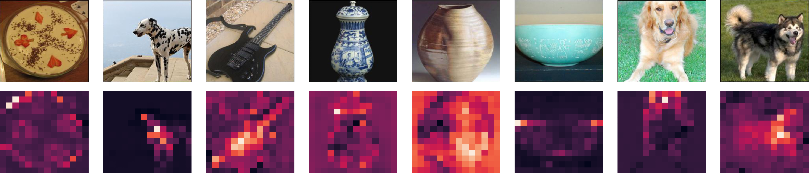

# FewTURE - Rethinking Generalization in Few-Shot Classification
Official PyTorch implementation of the paper **Rethinking Generalization in Few-Shot Classification**.

:mortar_board: :page_facing_up: Find our paper: [[arXiv]](https://arxiv.org/abs/2206.07267) &nbsp;&nbsp;&nbsp;&nbsp;| &nbsp;&nbsp;&nbsp;&nbsp; 
:bookmark: Reference: [[BibTeX]](https://github.com/mrkshllr/FewTURE#citing-fewture)

## TL;DR :eyes:
<div align="center">
  
</div>

**FewTURE** is a novel approach to tackle the challenge of supervision collapse introduced by single image-level labels 
in few-shot learning. Splitting the input samples into patches and
encoding these via the help of Vision Transformers allows us to establish semantic
correspondences between local regions across images and independent of their
respective class. The most informative patch embeddings for the task at hand are
then determined as a function of the support set via online optimization at inference
time, additionally providing visual interpretability of ‘what matters most’ in the
image. We build on recent advances in unsupervised training of networks via
masked image modelling to overcome the lack of fine-grained labels and learn the
more general statistical structure of the data while avoiding negative image-level
annotation influence, aka supervision collapse.

**FewTURE** achieves strong performance on several few-shot classification benchmarks (Accuracy on unseen test set):


|  Dataset  |         5-Way 1-Shot          |   5-Way 5-Shot   |   
|:--------|:-----------------------------:|:----------------:|
| <i>mini</i>ImageNet | **72.40** ± <font size=1>0.78 | **86.38** ± <font size=1>0.49 |
|  <i>tiered</i>ImageNet  |       **76.32** ± <font size=1>0.87        | **89.96** ± <font size=1>0.55 | 
| CIFAR-FS |       **77.76** ± <font size=1>0.81        | **88.90** ± <font size=1>0.59 | 
| FC100 |       **47.68** ± <font size=1>0.78        | **63.81** ± <font size=1>0.75 |

<br>

**FewTURE** learns '<i>what matters most</i>' at inference time via online optimization:
<div align="center">
    
</div>


## Updates :tada:
- August 30, 2022: Release of our code -- **Try out FewTURE!**  :sparkles: :computer: :arrow_left:
- June 15, 2022: Release of our preprint on [arXiv](https://arxiv.org/abs/2206.07267)

## Installation and Datasets
For detailed instruction how to set up your environment, install required packages and download the datasets, please refer to the [installation instructions](https://github.com/mrkshllr/FewTURE/blob/main/INSTALL.md).

## Training FewTURE
For a glimpse at the documentation of all arguments available for training, please check for **self-supervised training**:
```
python train_selfsup_pretrain.py --help
```
and for **meta fine-tuning**:
```
python train_metatrain_FewTURE.py --help
```


### Self-Supervised Pretraining via Masked Image Modelling
To start the self-supervised pre-training procedure using a **ViT-small** architecture on one node with 4 GPUs using a total **batch size** of **512** for **1600 epochs** on **miniImageNet**, run:
```
export MASTER_ADDR=127.0.0.1
export MASTER_PORT=12345
export WORLD_SIZE=4
echo "Using Master_Addr $MASTER_ADDR:$MASTER_PORT to synchronise, and a world size of $WORLD_SIZE."

echo "Start training..."
torchrun --nproc_per_node 4 train_selfsup_pretrain.py --use_fp16 True --arch vit_small --epochs 1600 --batch_size_per_gpu 128 --teacher_temp 0.07 --warmup_teacher_temp_epochs 30 --norm_last_layer false --dataset miniimagenet --image_size 224 --data_path <path-to-dataset> --saveckp_freq 50 --shared_head true --out_dim 8192  --local_crops_number 10 --global_crops_scale 0.25 1 --local_crops_scale 0.05 0.25 --pred_ratio 0 0.3 --pred_ratio_var 0 0.2
echo "Finished training!"
```
If you want to instead train a swin Transformer architecture, choose `--arch swin_tiny`. 
Since swin models generally lead to higher memory consumption, consider using multiple nodes 
for training (we use 2 in our paper with a batch size of 64 per GPU), or experiment with reducing the overall batch size. We also recommend reducing the number of epochs (e.g. 300 - 800).


_Note_: Make sure to provide the path to the folder where you stored the datasets via the `--data_path <path-to-dataset>` argument.

### Meta Fine-tuning 
To start the meta fine-tuning procedure using a previously pretrained **ViT-small** architecture using 
one GPU for **100 epochs** on the **miniImageNet** training dataset using **5 steps** to adapt the **token importance weights** via online-optimisation at inference time, run:
- For a 5-way 5-shot scenario:
```
python3 train_metatrain_FewTURE.py --epochs 100 --data_path <path-to-dataset> --arch vit_small --n_way 5 --k_shot 5 --optim_steps_online 5  --chkpt_epoch 1599 --mdl_checkpoint_path <path-to-checkpoint-of-pretrained-model>
```
- For a 5-way 1-shot scenario:
```
python3 train_metatrain_FewTURE.py --epochs 100 --data_path <path-to-dataset> --arch vit_small --n_way 5 --k_shot 1 --optim_steps_online 5  --chkpt_epoch 1599 --mdl_checkpoint_path <path-to-checkpoint-of-pretrained-model>
```
To instead meta fine-tune a pretrained hierarchical swin architecture, use the `--arch swin_tiny`. 

_Note_: Replace the `--data_path <path-to-dataset>` and possibly `--mdl_checkpoint_path <path-to-checkpoint-of-pretrained-model>` with the corresponding paths where you stored the model on your machine! 


## Evaluating FewTure
To evaluate a meta-trained **ViT-small** architecture on the **miniImageNet** test dataset, run:
- For a 5-way 5-shot scenario:
```
python3 eval_FewTURE.py --data_path <path-to-dataset> --arch vit_small --n_way 5 --k_shot 5 --trained_model_type metaft --optim_steps_online 5  --mdl_checkpoint_path <path-to-checkpoint-of-metaft-model>
```
- For a 5-way 1-shot scenario:
```
python3 eval_FewTURE.py --data_path <path-to-dataset> --arch vit_small --n_way 5 --k_shot 1 --trained_model_type metaft --optim_steps_online 5  --mdl_checkpoint_path <path-to-checkpoint-of-metaft-model>
```


## Acknowledgement

This repository is built using components of the [iBOT](https://github.com/bytedance/ibot/) and 
[DINO](https://github.com/facebookresearch/dino) repositories for pre-training,
and the [DeepEMD](https://github.com/icoz69/DeepEMD) and 
[CloserLookFewShot](https://github.com/wyharveychen/CloserLookFewShot) repositories for loading the few-shot datasets.


## License
This repository is released under the Apache 2.0 license as found in the [LICENSE](https://github.com/mrkshllr/FewTURE/blob/main/LICENSE) file.

## Citing FewTURE
If you find this repository useful, please consider giving us a star :star: and cite our [work](https://arxiv.org/abs/2206.07267):
```
@article{hillerma2022fewture,
  title={Rethinking Generalization in Few-Shot Classification},
  author={Hiller, Markus and Ma, Rongkai and Harandi, Mehrtash and Drummond, Tom},
  journal={arXiv preprint arXiv:2206.07267},
  year={2022}
}
```
If you have any questions regarding our work, please feel free to reach out!